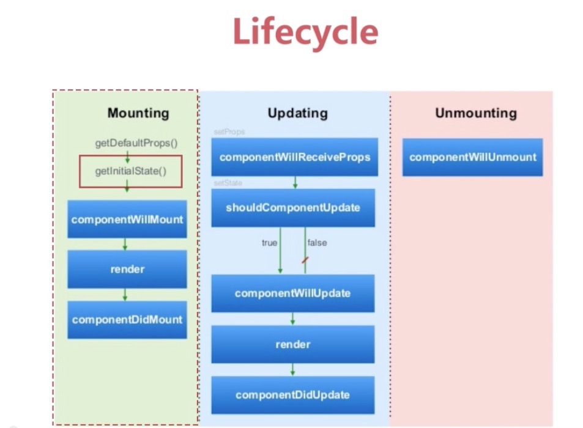

#React test
##简介

1. 前段UI的开发框架
2. 前置内容
	- `Sass`,`Comonpas`
	- `Yeoman`,`Grunt`,`Webpack`
	- `CommonJS`,`NodeJS`
3. [学习地址](http://www.xxx.xxx)

##hello world

```html
<div id="container">
    <!-- This element's contents will be replaced with your component. -->
</div>
```
```js
var Hello = React.createClass({
  render: function() {
    return <div>Hello {this.props.name}</div>;
    //这里的节点不是dom节点
    //这里的{ }指的是要取js的表达式的值
  }
});

ReactDOM.render(
  <Hello name="World" />,
  document.getElementById('container')
);

```

##JSX和Style

#####JSX

* 语法糖
* 类似TypeScript,CoffeeScript
* 可以在js中直接写
* 在hello world中些的所有的标签都是`react components`,包括div标签,这些div标签代表的都不是dom节点,而是react components实例.
* this指的是components的实例
* 用{ }来执行js的表达式.
* props指的是component在使用的时候属性的集合

#####style


* 使用class

```js
	
return <div className='alert-text'></div>
``` 


* 内联样式

```js
	
//在jsx中style需要用样式对象表示.在jsx中js的表达式需要用{}
//样式key使用的驼峰写法.
var style = {color:'red'}
return <div style={style}></div>
```
	
##React-Components-Lifecycle


- `Mounted`:

	React Components在`render`解析,生成对应的DOM节点,并被插入到浏览器DOM结构的过程
- `Update`:

	一个moounted的React Components重新render的过程.
	DOM不一定会改变,只有react在比较了dom之后.
- `Unmounted`

	控件从对应的DOM节点移除.
- `hook`

	react对状态都封装了对应的hook函数.

 
 
#### hook

`Mounting`

 	
- `componentWillMount`
- `componentDidMount`
- `getInitialState()`
	- 用来初始化state

`Updating`

- `componentWillReceiveProps`
	- 组件接收到新的`prop`时候调用,函数参数就是新的`prop`,可以和`this.prop`进行比较.
- `shouldComponentUpdate`
	- 函数有两个参数,`props`和`state`,可以根据需要通过返回true/false来决定是否要继续.
	
	
##### `props`和`state`

- `props`往往是组件的调用方在调用组件的时候指定的,指定了一般情况下修改.属于调用方.
- `state`是属于组件自己的.会根据条件修改的.
- 修改`state`,调用组件对象的`setState({})`;`state`的修改会导致组件进入`updating`状态.导致重新`render`

##react事件绑定

- 通过on+事件名称驼峰法,为组件添加事件.
- 函数的参数是event对象,是jsevent的封装,具有原生的特性.
- 可以通过`tip`属性对组件添加名称,用于在程序中查找.
- 可以通过`React.findDOMNode`,拿到dom

```js
var Hello  = React.createClass({
	handleClick:function(event){
		var tip = this.refs.tip//拿到的是react组件
		var tipEl = React.findDOMNode(this.refs.tip);//拿到真实的dom
		event.stopPropagation();
		event.preventDefault();
	},
	render:function(){
		return (
			<div>
				<button onClick={this.handleClick}>
				<span ref='tip'>
				</button>
			</div>
		);
	}
});
```

```js
var Hello = React.createClass({
	handleClick:function(event){
		this.setState({
			inputContent:event.target.value
		});
		event.stopPropagation();
		event.preventDefault();
	},
	render:function(){
		return (
				<div>
					<input type='text' onChange={this.handleChange}/>
					<span>{this.state.inputContent}</span>
				</div>
	}
});

```

##基础知识

- #####render
	- `render`函数中只能有一个组件,所以多个组件需要用div等作为容器
	
	```javascript
	React.render(<div><Test1></Test1><Test2></Test2></div>
	,document.getElementById('container'));
	```
	
	- 同样,在用`React.createClass({})`;中的`render`函数,在`return`的时候也需要用div等作为容器.否则就是返回了多个组件.

	```js
	var Hello = React.createClass({
		render:function(){
			return (
				<div>
				
				</div>
			);
		}
	});
	```


